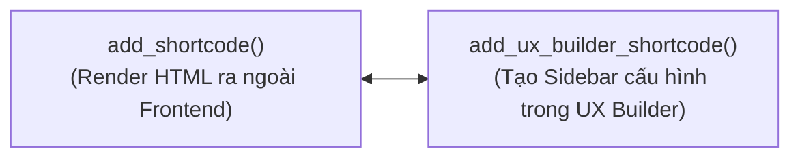

# HƯỚNG DẪN MỞ RỘNG CUSTOM ELEMENT TRONG FLATSOME UX BUILDER CHO DEVELOPER

Tài liệu này cung cấp hướng dẫn lập trình chuẩn mực để thêm các Element tùy biến (Custom UX Builder Elements) vào trình kéo thả của Flatsome thông qua Child Theme hoặc Custom Plugin.

---

## 1. NGUYÊN LÝ HOẠT ĐỘNG CỦA UX BUILDER API

Để một phần tử tùy biến xuất hiện trong danh sách phần tử của UX Builder và hoạt động trơn tru trên trang web, lập trình viên cần thực hiện đúng **2 nhiệm vụ cốt lõi**:
1. **Frontend Rendering:** Đăng ký hàm shortcode WordPress tiêu chuẩn bằng `add_shortcode()`.
2. **Visual Builder Integration:** Đăng ký giao diện điều khiển với UX Builder bằng hàm `add_ux_builder_shortcode()`.



---

## 2. BẢNG CÁC KIỂU CONTROLS ĐƯỢC UX BUILDER HỖ TRỢ

Trong mảng `'options'` của hàm `add_ux_builder_shortcode()`, Flatsome hỗ trợ đầy đủ các kiểu trường nhập liệu sau:

| Kiểu control (`type`) | Mô tả giao diện | Các tham số tùy chọn chính |
| :--- | :--- | :--- |
| `'textfield'` | Hộp nhập văn bản 1 dòng. | `'heading'`, `'default'`, `'placeholder'` |
| `'textarea'` | Hộp nhập văn bản nhiều dòng hoặc mã HTML. | `'heading'`, `'default'`, `'rows'` |
| `'select'` | Danh sách thả xuống (Dropdown Select). | `'heading'`, `'default'`, `'options' => array('val' => 'Label')` |
| `'colorpicker'` | Bảng chọn màu sắc trực quan (Hex / RGBA). | `'heading'`, `'default'`, `'format' => 'rgb'` |
| `'image'` | Hộp chọn ảnh tích hợp WordPress Media Library. | `'heading'`, `'default'` (trả về Image ID) |
| `'slider'` | Thanh trượt số trực quan. | `'heading'`, `'default'`, `'min'`, `'max'`, `'unit' => 'px'` |
| `'checkbox'` | Nút bật/tắt (Toggle Switch). | `'heading'`, `'default' => 'false'` |
| `'radio-group'` | Bộ nút bấm lựa chọn theo cụm (Segmented Controls). | `'heading'`, `'default'`, `'options' => array('left' => 'Trái', 'center' => 'Giữa')` |
| `'margins'` | Bộ 4 ô nhập khoảng cách lề (Top - Right - Bottom - Left). | `'heading'`, `'default'` |

---

## 3. MÃ NGUỒN MẪU HOÀN CHỈNH (BOILERPLATE CODE)

Dưới đây là đoạn code chuẩn bạn có thể dán trực tiếp vào file `functions.php` của **Flatsome Child Theme** để tạo một element có tên **"Bảng Thông Số Kỹ Thuật" (`[ux_spec_box]`)**:

```php
<?php
/**
 * 1. ĐĂNG KÝ SHORTCODE HIỂN THỊ FRONTEND
 */
function flatsome_custom_spec_box_shortcode( $atts, $content = null ) {
    $args = shortcode_atts( array(
        'title'        => 'Thông Số Kỹ Thuật',
        'highlight'    => 'Chính Hãng',
        'warranty'     => '12 Tháng',
        'bg_color'     => '#f8fafc',
        'border_color' => '#e2e8f0',
        'class'        => '',
    ), $atts );

    ob_start();
    ?>
    <div class="custom-spec-box <?php echo esc_attr( $args['class'] ); ?>" style="background-color: <?php echo esc_attr( $args['bg_color'] ); ?>; border: 1px solid <?php echo esc_attr( $args['border_color'] ); ?>; border-radius: 8px; padding: 25px; margin-bottom: 25px;">
        <div class="spec-box-header" style="display: flex; justify-content: space-between; align-items: center; border-bottom: 2px solid <?php echo esc_attr( $args['border_color'] ); ?>; padding-bottom: 12px; margin-bottom: 15px;">
            <h4 class="uppercase" style="margin-bottom: 0; color: #0f172a; font-weight: 700;">
                <i class="icon-checkmark" style="color: #2563eb; margin-right: 6px;"></i>
                <?php echo esc_html( $args['title'] ); ?>
            </h4>
            <span class="badge" style="background-color: #2563eb; color: #ffffff; padding: 3px 10px; border-radius: 4px; font-size: 80%;">
                <?php echo esc_html( $args['highlight'] ); ?>
            </span>
        </div>
        
        <div class="spec-box-content" style="color: #334155; line-height: 1.8;">
            <?php echo do_shortcode( $content ); ?>
        </div>

        <div class="spec-box-footer" style="margin-top: 15px; padding-top: 10px; border-top: 1px dashed <?php echo esc_attr( $args['border_color'] ); ?>; font-size: 90%; color: #64748b;">
            <i class="icon-clock" style="margin-right: 5px;"></i> Thời hạn bảo hành cam kết: <strong><?php echo esc_html( $args['warranty'] ); ?></strong>
        </div>
    </div>
    <?php
    return ob_get_clean();
}
add_shortcode( 'ux_spec_box', 'flatsome_custom_spec_box_shortcode' );

/**
 * 2. ĐĂNG KÝ VỚI FLATSOME UX BUILDER
 */
function flatsome_register_custom_spec_box_builder() {
    if ( function_exists( 'add_ux_builder_shortcode' ) ) {
        add_ux_builder_shortcode( 'ux_spec_box', array(
            'name'      => __( 'Khối Thông Số Kỹ Thuật', 'flatsome' ),
            'category'  => __( 'Content', 'flatsome' ),
            'priority'  => 10,
            'options'   => array(
                'title' => array(
                    'type'    => 'textfield',
                    'heading' => __( 'Tiêu Đề Box', 'flatsome' ),
                    'default' => 'Thông Số Kỹ Thuật',
                ),
                'highlight' => array(
                    'type'    => 'textfield',
                    'heading' => __( 'Huy Hiệu Nổi Bật', 'flatsome' ),
                    'default' => 'Chính Hãng',
                ),
                'warranty' => array(
                    'type'    => 'textfield',
                    'heading' => __( 'Thời Gian Bảo Hành', 'flatsome' ),
                    'default' => '12 Tháng',
                ),
                'bg_color' => array(
                    'type'    => 'colorpicker',
                    'heading' => __( 'Màu Nền', 'flatsome' ),
                    'default' => '#f8fafc',
                ),
                'border_color' => array(
                    'type'    => 'colorpicker',
                    'heading' => __( 'Màu Đường Viền', 'flatsome' ),
                    'default' => '#e2e8f0',
                ),
                'content' => array(
                    'type'    => 'textarea',
                    'heading' => __( 'Nội Dung Chi Tiết', 'flatsome' ),
                    'default' => "<ul>\n  <li>Vi xử lý: Apple M3 Pro 12-core</li>\n  <li>RAM: 36GB Unified Memory</li>\n  <li>Bộ nhớ: 512GB SSD siêu tốc</li>\n</ul>",
                ),
                'class' => array(
                    'type'    => 'textfield',
                    'heading' => __( 'Custom Class', 'flatsome' ),
                    'default' => '',
                ),
            ),
        ) );
    }
}
add_action( 'ux_builder_setup', 'flatsome_register_custom_spec_box_builder' );
```

---

## 4. TẠO ELEMENT DẠNG WRAPPER / CONTAINER (CHO PHÉP KÉO THẢ CON)

Nếu bạn muốn tạo một phần tử có thể chứa các phần tử khác bên trong (tương tự như `[section]` hoặc `[row]`), chỉ cần bổ sung tham số `'type' => 'container'`:

```php
add_ux_builder_shortcode( 'my_custom_container', array(
    'type'     => 'container', // Bắt buộc để cho phép kéo thả các element khác vào trong
    'name'     => __( 'Khung Chứa Đặc Biệt', 'flatsome' ),
    'category' => __( 'Layout', 'flatsome' ),
    'options'  => array(
        'padding' => array(
            'type'    => 'margins',
            'heading' => __( 'Khoảng đệm Padding', 'flatsome' ),
            'default' => '30px',
        ),
    ),
) );
```

---

## 5. TÙY BIẾN HOẶC GỠ BỎ ELEMENT CÓ SẴN TRONG FLATSOME

Dựa trên mã nguồn gốc `inc/builder/core/server/helpers/shortcodes.php`, Flatsome cung cấp 2 hàm tiện ích để can thiệp vào các element cốt lõi của theme:

### 5.1. Chỉnh sửa thuộc tính của Element có sẵn (`ux_builder_edit_element`):
Ví dụ: Muốn bổ sung thêm tùy chọn màu sắc mới vào shortcode `[button]` của Flatsome:
```php
add_action( 'ux_builder_setup', function() {
    if ( function_exists( 'ux_builder_edit_element' ) ) {
        ux_builder_edit_element( 'button', array(
            'options' => array(
                'custom_badge' => array(
                    'type'    => 'textfield',
                    'heading' => __( 'Huy Hiệu Phụ (Badge)', 'flatsome' ),
                    'default' => '',
                ),
            ),
        ) );
    }
} );
```

### 5.2. Gỡ bỏ Element không mong muốn (`remove_ux_builder_shortcode`):
Ví dụ: Ẩn bớt các element không dùng để giao diện kéo thả gọn gàng hơn cho khách hàng:
```php
add_action( 'ux_builder_setup', function() {
    if ( function_exists( 'remove_ux_builder_shortcode' ) ) {
        // Gỡ bỏ element bản đồ Google Map nếu website không dùng đến
        remove_ux_builder_shortcode( 'map' );
    }
} );
```

