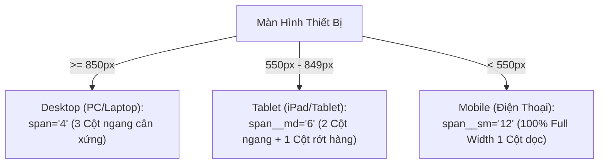

# QUY CHUẨN HỆ THỐNG LƯỚI 12 CỘT & NGUYÊN TẮC LỒNG THẺ TRONG FLATSOME

Tài liệu này cung cấp hướng dẫn chuyên sâu về toán học lưới (Grid Math), phân cấp lồng thẻ an toàn và quy tắc responsive đa thiết bị trong Flatsome UX Builder.

---

## 1. TOÁN HỌC HỆ THỐNG LƯỚI 12 CỘT (THE 12-COLUMN GRID MATH)

Flatsome xây dựng bố cục dựa trên hệ thống lưới 12 cột (12-column grid system) sử dụng Flexbox hiện đại. Mọi hàng (`[row]`) được chia thành 12 phần bằng nhau.

### 1.1. Công Thức Tổng Bằng 12
Trong cùng một hàng ngang trên Desktop:
$$\sum \text{span} = 12$$

Nếu tổng số `span` vượt quá 12, các cột thừa sẽ tự động rớt xuống hàng tiếp theo (Column Wrapping). Trừ khi đó là chủ đích thiết kế (vd: lưới 6 sản phẩm chia làm 2 hàng 3 cột `span="4"`), hãy luôn đảm bảo tổng các cột cùng hàng bằng đúng 12 để tránh khoảng trống thừa (whitespace gap).

### 1.2. Bảng Phân Bổ Cột Chuẩn Hóa
| Số lượng cột | Giá trị `span` Desktop | Giá trị `span__md` Tablet | Giá trị `span__sm` Mobile | Ứng dụng thực tế |
| :---: | :---: | :---: | :---: | :--- |
| **1 cột** | `span="12"` | `span__md="12"` | `span__sm="12"` | Khối tiêu đề, Banner toàn trang, Bài viết đơn. |
| **2 cột đều** | `span="6"` $\times$ 2 | `span__md="6"` $\times$ 2 | `span__sm="12"` $\times$ 2 | Cột trái Hình ảnh / Cột phải Văn bản & CTA. |
| **3 cột đều** | `span="4"` $\times$ 3 | `span__md="6"` hoặc `"12"` | `span__sm="12"` $\times$ 3 | 3 Gói dịch vụ, 3 Lợi ích chính, 3 Cột Footer. |
| **4 cột đều** | `span="3"` $\times$ 4 | `span__md="6"` $\times$ 4 | `span__sm="12"` $\times$ 4 | Khối 4 Tính năng (Icon Box), 4 Cột Widget Footer. |
| **6 cột đều** | `span="2"` $\times$ 6 | `span__md="4"` $\times$ 6 | `span__sm="6"` $\times$ 6 | Logo đối tác, Danh mục con rút gọn. |
| **Bất đối xứng (3 : 9)** | `span="3"` + `span="9"` | `span__md="12"` + `"12"` | `span__sm="12"` + `"12"` | Sidebar trái + Nội dung chính bài viết / Shop. |
| **Bất đối xứng (9 : 3)** | `span="9"` + `span="3"` | `span__md="12"` + `"12"` | `span__sm="12"` + `"12"` | Nội dung chính + Sidebar phải. |
| **Bất đối xứng (4 : 8)** | `span="4"` + `span="8"` | `span__md="12"` + `"12"` | `span__sm="12"` + `"12"` | Ảnh đại diện hồ sơ + Thông tin giới thiệu chi tiết. |
| **Bất đối xứng (5 : 7)** | `span="5"` + `span="7"` | `span__md="12"` + `"12"` | `span__sm="12"` + `"12"` | Form tư vấn nổi bật + Lợi ích kèm lời chứng thực. |

---

## 2. HỆ THỐNG BREAKPOINTS & MA TRẬN PHÂN BỔ CỘT 3 THIẾT BỊ

Flatsome phân chia giao diện thành 3 mốc màn hình (Viewports) chuẩn quốc tế:
1. **Large (Desktop):** Chiều rộng màn hình $\ge 850\text{px}$ (khai báo thuộc tính gốc: `span`, `columns`, `height`, `padding`).
2. **Medium (Tablet):** Chiều rộng màn hình từ $550\text{px}$ đến $849\text{px}$ (khai báo hậu tố `__md`: `span__md`, `columns__md`, `height__md`, `padding__md`).
3. **Small (Mobile):** Chiều rộng màn hình $< 550\text{px}$ (khai báo hậu tố `__sm`: `span__sm`, `columns__sm`, `height__sm`, `padding__sm`).



### 2.1. Ma Trận Chuyển Đổi Cột Chuẩn Hóa 3 Màn Hình:
| Loại Bố Cục | Desktop ($\ge 850\text{px}$) | Tablet ($550 - 849\text{px}$) | Mobile ($< 550\text{px}$) | Trải Nghiệm Người Dùng (UX) |
| :--- | :---: | :---: | :---: | :--- |
| **Lưới 4 Cột** | `span="3"` | `span__md="6"` | `span__sm="12"` (hoặc `"6"`) | Desktop 4 cột $\rightarrow$ Tablet chia 2 hàng 2 cột $\rightarrow$ Mobile xếp 1 cột dọc thanh thoát. |
| **Lưới 3 Cột** | `span="4"` | `span__md="6"` hoặc `"12"` | `span__sm="12"` | Desktop 3 cột đều $\rightarrow$ Tablet 2 cột hoặc 1 cột $\rightarrow$ Mobile cuộn dọc 100%. |
| **Lưới 2 Cột Đều** | `span="6"` | `span__md="6"` hoặc `"12"` | `span__sm="12"` | Desktop 2 bên $\rightarrow$ Tablet giữ 2 bên $\rightarrow$ Mobile xếp chồng ảnh trước/chữ sau. |
| **Lưới Lệch 4 : 8** | `span="4"` + `span="8"` | `span__md="12"` + `"12"` | `span__sm="12"` + `"12"` | Desktop bài lớn + danh sách $\rightarrow$ Tablet & Mobile tự động xếp chồng full-width. |
| **Lưới Lệch 3 : 9** | `span="3"` + `span="9"` | `span__md="12"` + `"12"` | `span__sm="12"` + `"12"` | Sidebar chuyển xuống dưới hoặc ẩn trên Mobile để ưu tiên nội dung chính. |

### 2.2. Quy Tắc Bắt Buộc Về Responsive Cột:
- **Tuyệt đối không để trống `span__sm`:** Nếu thiếu `span__sm`, trình duyệt điện thoại sẽ cố ép cột hiển thị theo tỷ lệ Desktop, dẫn đến vỡ chữ, tràn chữ và xuất hiện thanh cuộn ngang gây lỗi Mobile-Friendly của Google.
- **Quy tắc 2 Cột Trên Mobile (`span__sm="6"`):** Chỉ áp dụng khi nội dung trong cột là dạng nhỏ gọn (Card sản phẩm tối giản, ảnh thumbnail danh mục, logo đối tác). Không dùng `span__sm="6"` cho các khối có đoạn văn bản dài hoặc form đăng ký phức tạp.

---

## 3. NGUYÊN TẮC LỒNG THẺ (NESTING INTEGRITY)

Đây là quy tắc kỹ thuật tối quan trọng để giữ mã nguồn HTML sạch, hợp lệ và tương thích 100% với giao diện kéo thả trực quan của UX Builder:

### 3.1. Phân Cấp Khung Tiêu Chuẩn:
```
[section]
  └── [row]
        └── [col]
              ├── [elements / content]
              └── [row_inner] (Nếu muốn chia thêm cột con)
                    └── [col_inner]
                          └── [elements]
```

### 3.2. Cấm Tuyệt Đối Lồng `[row]` Trực Tiếp Trong `[col]`
> [!CAUTION]
> **LỖI VỠ LAYOUT NGUY HIỂM:**  
> Trong CSS của Flatsome, class `.row` mang giá trị `margin-left: -15px; margin-right: -15px;`. Khi bạn đặt `[row]` trực tiếp vào trong `[col]` mà không dùng `[row_inner]`, margin âm sẽ kéo dãn khung ra ngoài phạm vi padding của cột cha, gây hiện tượng thanh cuộn ngang khó chịu trên trình duyệt và phá vỡ cấu trúc Tree View trong UX Builder.

```html
<!-- SAI: -->
[row]
  [col span="6"]
    [row] <!-- SAI: Gây vỡ layout -->
      [col span="6"]...[/col]
    [/row]
  [/col]
[/row]

<!-- ĐÚNG: -->
[row]
  [col span="6" span__sm="12"]
    [row_inner] <!-- ĐÚNG: Dùng row_inner và col_inner -->
      [col_inner span="6" span__sm="12"]...[/col_inner]
      [col_inner span="6" span__sm="12"]...[/col_inner]
    [/row_inner]
  [/col]
[/row]
```

### 3.3. Quy Tắc `[ux_banner]` & `[text_box]`
- Mọi văn bản, tiêu đề, nút CTA nằm trên ảnh bìa `[ux_banner]` **bắt buộc** phải được bọc trong `[text_box]`.
- Thẻ `[text_box]` chịu trách nhiệm neo tọa độ (`position_x`, `position_y`), đổi màu chữ thông minh theo nền (`text_color="light"` / `"dark"`), và tạo hiệu ứng xuất hiện (`animate="fadeInUp"`).

---

## 4. TỐI ƯU KHOẢNG CÁCH (ROW STYLES & GUTTERS)

Thuộc tính `style` trong `[row style="..."]` quyết định khoảng cách giữa các cột (Gutters):

| Kiểu Hàng (`style`) | Khoảng cách Gutters | Trường hợp ứng dụng tối ưu |
| :--- | :--- | :--- |
| `style="default"` | `30px` (mỗi bên 15px) | Khoảng cách chuẩn hóa cho phần lớn các khối bài viết, sản phẩm, tin tức. |
| `style="large"` | `60px` (mỗi bên 30px) | Tạo không gian thoáng đãng, sang trọng cho website cao cấp, dịch vụ kiến trúc, spa. |
| `style="small"` | `15px` | Dành cho lưới ảnh nhỏ, thumbnail bộ sưu tập, icon box mật độ dày. |
| `style="collapse"`| `0px` (Dính liền nhau) | Dành cho các khối Banner cạnh nhau, ảnh ghép toàn màn hình không có viền ngăn. |
| `style="dashed"` | Có đường đứt nét | Khối phân cách các bước quy trình làm việc (Step 1 -> Step 2 -> Step 3). |
| `style="divided"` | Có đường kẻ liền mảnh | Phân cách cột rõ ràng theo phong cách báo chí, bảng giá, chỉ số thống kê. |
| `style="boxed"` | Khung bo viền hộp | Đóng khung nổi toàn bộ hàng thành một card lớn có nền và viền riêng. |

---

## 5. CĂN CHỈNH CHIỀU CAO ĐỀU NHAU (EQUAL HEIGHT COLUMNS)

Một trong những vấn đề phổ biến nhất trong thiết kế là các cột bên cạnh nhau có độ dài văn bản không đồng đều, làm chân cột bị so le.

Flatsome giải quyết triệt để vấn đề này với thuộc tính `v_align`:
```html
[row v_align="equal-height"]
  [col span="4" span__sm="12" bg_color="#ffffff" depth="2"]
    <!-- Cột này sẽ tự động kéo dài bằng cột cao nhất bên cạnh -->
  [/col]
  [col span="4" span__sm="12" bg_color="#ffffff" depth="2"]
    <!-- Cột này có nhiều nội dung hơn -->
  [/col]
  [col span="4" span__sm="12" bg_color="#ffffff" depth="2"]
    <!-- Cột này cũng dài đều đáy hoàn hảo -->
  [/col]
[/row]
```

Các giá trị khác của `v_align`:
- `v_align="top"`: Canh sát mép trên cùng (Mặc định).
- `v_align="middle"`: Canh đều chính giữa theo chiều dọc (Rất đẹp khi cột trái là Ảnh và cột phải là Chữ).
- `v_align="bottom"`: Canh sát đáy hàng.

---

## 6. TOÁN HỌC KHỚP CHIỀU CAO CHUẨN PIXEL (HEIGHT MATCHING MATH)

Trong các bố cục E-commerce chia 2 cột (Cột trái Slider lớn `span="8"`, Cột phải 2 hoặc 3 Banner phụ `span="4"` xếp chồng), **bắt buộc** chiều cao tổng của cột phụ phải bằng chính xác chiều cao của slider chính để hai cột bằng phẳng tuyệt đối.

### Công thức 2 Banner Phụ Xếp Chồng (Kèm 1 Gap):
$$\text{Height}_{\text{Slider}} = 2 \times \text{Height}_{\text{SubBanner}} + \text{Height}_{\text{Gap}}$$

- **Ví dụ chuẩn Desktop:**
  - Slider chính: `height="470px"`
  - 2 Banner phụ: `height="230px"`
  - Khoảng cách ở giữa: `[gap height="10px"]`
  - $\rightarrow 230\text{px} \times 2 + 10\text{px} = 470\text{px}$ (Khớp 100% không lệch 1 pixel!).
- **Ví dụ chuẩn Tablet (`height__md`):**
  - Slider chính: `height__md="380px"`
  - 2 Banner phụ: `height__md="185px"`
  - $\rightarrow 185\text{px} \times 2 + 10\text{px} = 380\text{px}$.

### Công thức 3 Banner Phụ Xếp Chồng (Kèm 2 Gaps):
$$\text{Height}_{\text{Slider}} = 3 \times \text{Height}_{\text{SubBanner}} + 2 \times \text{Height}_{\text{Gap}}$$
- **Ví dụ:** Slider `height="560px"`, 3 Banner phụ mỗi banner `height="173px"`, 2 gaps mỗi gap `10px` ($173 \times 3 + 20 \approx 560\text{px}$).

---

## 7. CÂN BẰNG CHIỀU CAO CHUẨN XÁC GIỮA BÀI NỔI BẬT & DANH SÁCH (HEIGHT BALANCING)

Trong bố cục tin tức gồm 1 bài lớn (bên trái `span="4"`) và danh sách 6 bài viết nhỏ 3 hàng (bên phải `span="8"`):
- **Nguyên nhân hụt đáy:** Với tỷ lệ ảnh mặc định `image_height="72%"`, tổng chiều cao bài viết bên trái chỉ đạt khoảng 283px (ảnh 223px + text 60px), trong khi 3 hàng bài viết bên phải có tổng chiều cao là 331px. Chênh lệch đúng 48px khiến đáy bài bên trái bị hụt lên trên.
- **CẢNH BÁO SẬP ẢNH (QUAN TRỌNG):** Tuyệt đối **KHÔNG** dùng CSS gán `padding-top: 0 !important;` hay `position: absolute` lên `.image-cover`. Flatsome sử dụng cơ chế Padding Aspect-Ratio để tạo kích thước hiển thị cho ảnh; việc triệt tiêu `padding-top` sẽ khiến container sụp đổ về 0px và làm **mất hoàn toàn hình ảnh**.
- **Giải pháp Chuẩn Mực 100%:**
  1. **Tính toán tỷ lệ bù đắp:** Độ chênh lệch $48\text{px} / 305\text{px} \approx 16\%$. Nâng tỷ lệ ảnh từ $72\% + 16\% = 88\% - 89\%$.
  2. **Shortcode:** Khai báo trực tiếp `image_height="89%"`.
  3. **CSS:** Thiết lập `.featured-news-box .image-cover { padding-top: 89% !important; }` trên Desktop (`@media (min-width: 850px)`).
  4. **Kết quả:** Đáy bài lớn bên trái phẳng tắp 100% từng pixel với mép đáy hàng thứ 3 bên phải, ảnh giữ nguyên độ sắc nét và hiệu ứng hover mượt mà.

---

## 8. QUY CHUẨN THIẾT KẾ CHO TABLET VÀ MOBILE (RESPONSIVE BLUEPRINT)

Để website đạt điểm tối đa trên Google Mobile-Friendly Test và mang lại trải nghiệm mượt mà, kỹ sư thiết kế Flatsome bắt buộc phải áp dụng bộ quy chuẩn dưới đây cho Tablet và Mobile:

### 8.1. Quy Chuẩn Thu Nhỏ Chiều Cao Banner (`[ux_banner]` Scaling)
Nếu giữ nguyên chiều cao Desktop (ví dụ: `500px`) trên màn hình điện thoại xoay dọc, banner sẽ chiếm toàn bộ màn hình khiến người dùng không thấy được nội dung phía dưới:
- **Tỷ lệ vàng thu nhỏ:**
  - Desktop: `height="480px"` đến `"550px"`
  - Tablet: `height__md="350px"` đến `"380px"`
  - Mobile: `height__sm="200px"` đến `"250px"`
- **Ví dụ mẫu chuẩn:**
  ```html
  [ux_banner height="480px" height__md="350px" height__sm="220px" bg="URL_ANH"]
  ```

### 8.2. Quy Chuẩn Hộp Chữ Trên Banner (`[text_box]` Coordinates)
Trên màn hình điện thoại hẹp, hộp chữ canh lề trái với độ rộng `50%` sẽ bị dồn ép thành các dòng 1-2 từ rất xấu:
- **Nguyên tắc chuyển đổi:**
  - Desktop: `width="50%" position_x="10" position_y="50" text_align="left"`
  - Mobile: `width__sm="90%" position_x__sm="50" position_y__sm="50" text_align="center"`
- **Kết quả:** Trên điện thoại, hộp chữ tự động canh giữa màn hình và mở rộng ra 90% diện tích, giúp câu từ thông thoáng, dễ đọc.

### 8.3. Bố Cục Danh Sách Sản Phẩm & Tin Tức Trên Mobile:
1. **Lưới sản phẩm danh mục (`[ux_products]`):**
   - Luôn sử dụng `columns__sm="2"`. Tuyệt đối không dùng 1 cột vì ảnh sản phẩm sẽ bị phóng quá to, chiếm hết diện tích cuộn của khách hàng.
   - Bổ sung `equalize_box="true"` để các thẻ sản phẩm 2 cột bằng phẳng đều tăm tắp.
2. **Khối Flash Sale / Sản phẩm ưu đãi:**
   - Khuyến nghị dùng `type="slider" columns__sm="2" slider_nav_style="simple"` để khách hàng có thể dùng ngón tay vuốt ngang tiện lợi (Touch Swipe).
3. **Danh sách tin tức bài viết (`[blog_posts]`):**
   - Với bố cục 1 bài lớn + danh sách bài nhỏ: Trên Mobile bắt buộc danh sách nhỏ phải chuyển về `columns__sm="1"`, giúp hình thumbnail và tiêu đề nằm ngang đọc rõ ràng, không bị chèn ép.

### 8.4. Quy Chuẩn Vùng Chạm & Nút Bấm Di Động (Touch Target $\ge 44\text{px}$)
Theo chuẩn Google Core Web Vitals (INP - Interaction to Next Paint) và Accessibility:
- Nút bấm `[button]` trên Mobile nên có thuộc tính `size__sm="medium"` hoặc thêm `expand="1"` để nút kéo dài 100% bề ngang, ngón cái dễ dàng nhấn trúng.
- Khoảng cách giữa các liên kết / nút bấm tối thiểu `10px` để tránh bấm nhầm.

### 8.5. Kỹ Thuật Đảo Thứ Tự Cột Trên Mobile (Column Reordering):
Khi thiết kế 2 cột: Cột 1 là Văn bản, Cột 2 là Ảnh sản phẩm. Trên Desktop, chữ bên trái ảnh bên phải là chuẩn. Nhưng trên Mobile, bạn muốn **Ảnh sản phẩm hiện trước rồi mới đến chữ**:
- Sử dụng class `.flex-col-reverse-small` hoặc CSS:
  ```css
  @media (max-width: 549px) {
      .reverse-mobile-row {
          display: flex !important;
          flex-direction: column-reverse !important;
      }
  }
  ```


